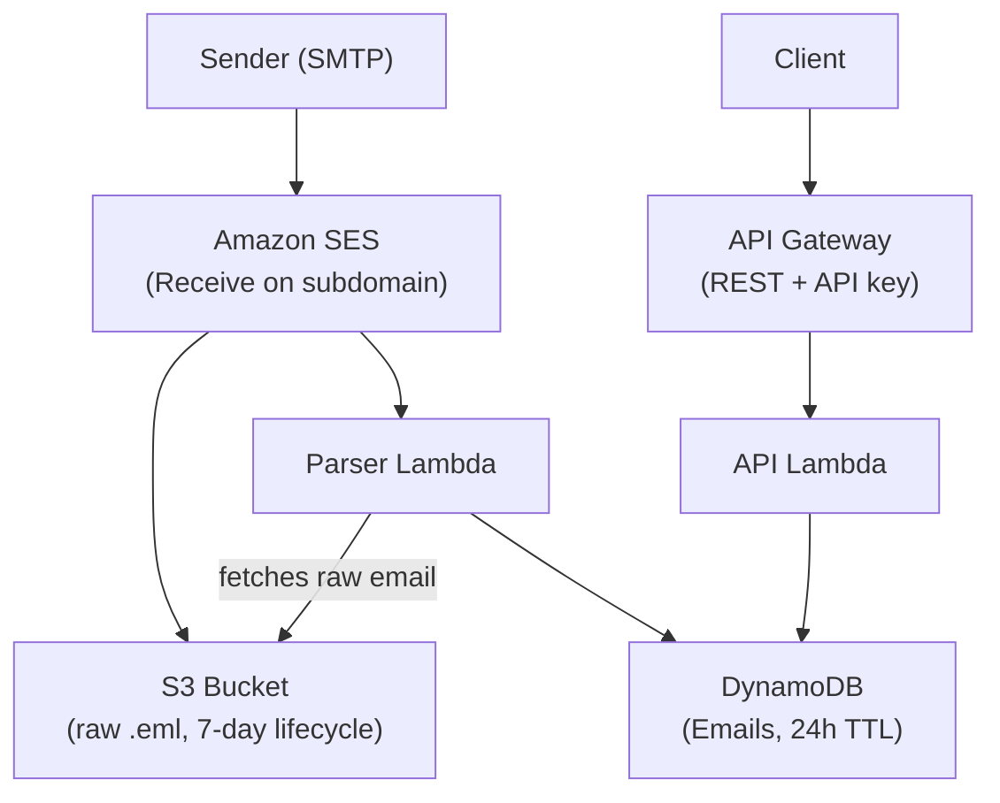

# Test Inbox

Serverless disposable email service built on AWS. Receive emails on a subdomain, parse them, and query via REST API. Designed for E2E test email verification (OTP flows, signup confirmations, etc.).

## Architecture



### Flow

1. Client generates an email address: `{session-id}@mail.yourdomain.com`
2. An external system sends an email to that address
3. SES receives the email on the subdomain and triggers two actions:
   - Stores the raw `.eml` file in S3
   - Invokes the Parser Lambda
4. Parser Lambda fetches the raw email from S3, uses the local part (everything before `@`) as the session ID, and writes metadata to DynamoDB
5. Client polls the API to retrieve the email(s) for that session

### Email Addressing

The local part of the email address (before `@`) is the session ID:

```
{session-id}@{subdomain}
     ^            ^
     |            └── Your configured subdomain (e.g. mail.yourdomain.com)
     └── Unique identifier per mailbox (UUID, nanoid, etc.)
```

No server-side mailbox creation needed. The mailbox exists implicitly when someone sends to that address. The entire subdomain is dedicated to this service.

### DynamoDB Schema

| Key | Format | Description |
|-----|--------|-------------|
| PK  | `INBOX#{sessionId}` | Partition key - groups emails by session |
| SK  | `EMAIL#{timestamp}#{messageId}` | Sort key - orders emails chronologically |

Items auto-expire after 24 hours via DynamoDB TTL.

## Prerequisites

- AWS CLI configured with credentials
- Node.js 20+
- pnpm (`npm install -g pnpm`)
- CDK CLI (`pnpm add -g aws-cdk`)
- A domain you own (you'll use a subdomain for receiving)

## Setup

### 1. Install dependencies

```bash
pnpm install
```

### 2. Deploy the stack

SES email receiving is only available in: `us-east-1`, `us-west-2`, `eu-west-1`.

```bash
pnpm exec cdk deploy -c subdomain=mail.yourdomain.com
# Optionally override region (defaults to eu-west-1):
pnpm exec cdk deploy -c subdomain=mail.yourdomain.com -c region=us-east-1
```

### 3. Configure DNS

After deployment, add an MX record to your domain's DNS for the subdomain:

```
mail.yourdomain.com  MX  10  inbound-smtp.{region}.amazonaws.com
```

Replace `{region}` with the region you deployed to (e.g. `eu-west-1`).

### 4. Activate the SES Receipt Rule Set

SES requires the receipt rule set to be active. Only one rule set can be active at a time per region:

```bash
aws ses set-active-receipt-rule-set --rule-set-name test-inbox-rules --region eu-west-1
```

### 5. Get the API key

The deploy output includes the API key ID. Retrieve the actual key value:

```bash
aws apigateway get-api-key --api-key <API_KEY_ID> --include-value --query 'value' --output text
```

## API

All endpoints require the `x-api-key` header.

### List messages

```
GET /mailbox/{sessionId}/messages
```

Response:
```json
{
  "messages": [
    {
      "messageId": "abc123",
      "from": "sender@example.com",
      "subject": "Your OTP code",
      "receivedAt": "2026-04-22T10:30:00.000Z",
      "bodyText": "Your code is 123456",
      "bodyHtml": "<p>Your code is <b>123456</b></p>"
    }
  ]
}
```

### Get single message

```
GET /mailbox/{sessionId}/messages/{messageId}
```

### Delete mailbox

```
DELETE /mailbox/{sessionId}
```

## Usage Example (E2E Test)

```typescript
import { nanoid } from "nanoid";

const API_URL = "https://xxx.execute-api.eu-west-1.amazonaws.com/prod";
const API_KEY = "your-api-key";
const SUBDOMAIN = "mail.yourdomain.com";

// 1. Generate a unique email address
const sessionId = nanoid();
const testEmail = `${sessionId}@${SUBDOMAIN}`;

// 2. Use this email in your signup/OTP flow
await triggerSignup(testEmail);

// 3. Poll for the email
const poll = async (sessionId: string, timeoutMs = 30000, intervalMs = 2000) => {
  const start = Date.now();
  while (Date.now() - start < timeoutMs) {
    const res = await fetch(`${API_URL}/mailbox/${sessionId}/messages`, {
      headers: { "x-api-key": API_KEY },
    });
    const data = await res.json();
    if (data.messages.length > 0) return data.messages;
    await new Promise((r) => setTimeout(r, intervalMs));
  }
  throw new Error("Timed out waiting for email");
};

const messages = await poll(sessionId);
const otp = messages[0].bodyText.match(/\d{6}/)?.[0];
```

## Useful Commands

| Command | Description |
|---------|-------------|
| `pnpm run build` | Compile TypeScript to JS |
| `pnpm exec cdk synth -c subdomain=mail.yourdomain.com` | Emit CloudFormation template |
| `pnpm exec cdk deploy -c subdomain=mail.yourdomain.com` | Deploy stack |
| `pnpm exec cdk diff -c subdomain=mail.yourdomain.com` | Compare deployed vs local |
| `pnpm exec cdk destroy -c subdomain=mail.yourdomain.com` | Tear down stack |

## Cleanup

DynamoDB items auto-expire after 24h. S3 objects auto-delete after 7 days. To remove everything:

```bash
pnpm exec cdk destroy -c subdomain=mail.yourdomain.com
```
